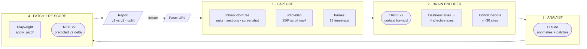

<div align="center">


# **Compound**

### *User testing, without users.*

**A closed-loop neural UX analyser.**
Paste any URL. We render it, predict the brain's response, find the weakest section, redesign it with Claude, patch the live DOM, and re-score — all in one cycle.

[Pipeline](#-the-pipeline) ·
[Architecture](#-architecture) ·
[Quickstart](#-quickstart) ·
[API](#-api) ·
[Repo layout](#-repo-layout) ·
[Master plan](./tribeux-master-plan.md)

</div>

---

## ✦ The 30-second pitch

> Paste any website URL → Playwright captures it as a 256×256 video → the **TRIBE v2** brain encoder maps the emotional response, second-by-second → that response is z-scored against our benchmark of 30 real homepages → Claude reads the time-series anomalies and proposes targeted DOM edits → a custom DOM tool injects the HTML changes → the analysis re-runs in a complete loop until the page converges.

You ship UX changes that an LLM can argue for, on data a brain encoder produced — without ever needing a real user to click anything.

---

## 🧠 The pipeline

```
URL ──► tribeux_domtree.analyze       (units · sections · screenshot)
    ──► urltovideo.URLRecorder        (15s scroll → 256×256 @ 30fps mp4)
    ──► tribeux_server.frames         (13 × 256² frames, one per timestep)
    ──► tribeux_server.inference      (TRIBE v2 → 4-axis cortical scores
                                        ⟂ attention · self-relevance
                                          reward · disgust)
    ──► tribeux_server.cohort         (z-score vs n=30 landing-page corpus)
    ──► tribeux_server.claude_analyst (anomalies + ≤2 minimal DOM patches)
    ──► tribeux_domtree.patch         (Playwright applies each patch live)
    ──► tribeux_server.inference v2   (predicted post-edit cortical delta)
    ──► Report                        (v1 vs v2 · per-axis uplift · before/after)
       │
       └── if not converged → loop: feed history into the next iteration
```

Every stage streams logs and progress to the frontend over Server-Sent Events,
so the demo page renders the brain canvas, frame strip and stage labels live
as the pipeline runs.



---

## ✦ Architecture

```
                    ┌───────────────────────────────────────────────┐
                    │  tribeux/app  (Vite + React 19, port 5173)    │
                    │  Landing → Demo (live SSE) → Report → Pitch   │
                    └────────────────────────┬──────────────────────┘
                                       /api  │  proxied via vite
                                             ▼
                    ┌───────────────────────────────────────────────┐
                    │  tribeux-server  (FastAPI, port 8000)         │
                    │  POST /api/analyze  →  job_id                 │
                    │  GET  /api/jobs/:id ·  full Report            │
                    │  GET  /api/jobs/:id/events  (SSE)             │
                    │  GET  /api/jobs/:id/chain   (iteration tree)  │
                    └─────┬───────────────┬──────────────┬──────────┘
                          │               │              │
                ┌─────────▼─────┐ ┌───────▼──────┐ ┌─────▼────────────┐
                │ urltovideo    │ │ tribeux-     │ │ TRIBE v2 service │
                │ Playwright +  │ │ domtree      │ │ (HTTP /score)    │
                │ moviepy       │ │ extract +    │ │ — optional, the  │
                │ 256² mp4      │ │ patch        │ │ stub is the      │
                └───────────────┘ └──────────────┘ │ default          │
                                                   └──────────────────┘
                                                              │
                                                              ▼
                                                ┌─────────────────────┐
                                                │ Anthropic / Claude  │
                                                │ (mocked by default) │
                                                └─────────────────────┘
```

The server is **the only thing the frontend talks to.** Inference, DOM
analysis, patching and Claude are all internal. Every external integration
(TRIBE v2, Anthropic, the live browser) has a deterministic fallback so the
demo runs offline and in CI.

---

## ✦ Repo layout

| Path | What it is |
|------|------------|
| **[`tribeux/app`](./tribeux/app)** | The main user-facing site — Vite + React 19 + Framer Motion + Three.js. Routes: `/` Landing, `/demo` live pipeline runner with SSE-driven brain canvas, `/report` before/after with draggable slider and per-axis time-series, `/pitch` deck. |
| [`tribeux/app-lab`](./tribeux/app-lab) | Sandbox / lab variant of the frontend used for prototyping motion + canvas ideas. |
| [`tribeux/frontend`](./tribeux/frontend) | Static design canvas + tweaks-panel scratch used to explore the report layout before it landed in `app`. |
| **[`tribeux-server`](./tribeux-server)** | FastAPI orchestrator. Single async pipeline (`pipeline.run_pipeline`), in-memory job store with pub/sub, SSE event stream, cohort + sample fixtures. |
| **[`tribeux-domtree`](./tribeux-domtree)** | DOM analysis package. Renders pages with Playwright, extracts and scores semantic units, clusters them into sections (`hero`, `nav`, `cta`, `features`, `footer`…), and applies HTML patches surgically by selector. |
| **[`urltovideo`](./urltovideo)** | Tiny Playwright + moviepy package: navigate to a URL, smooth-scroll to the bottom, return text + a 256×256 @ 30fps mp4. Used both by the server and as a standalone toolkit. |
| [`neuro_ux_pipeline.py`](./neuro_ux_pipeline.py) | Standalone Python prototype that wires `urltovideo` + `tribeux-domtree` into the same iteration loop without the FastAPI layer. |
| [`tribeux-master-plan.md`](./tribeux-master-plan.md) | Long-form design doc — the full product spec, license stance on TRIBE v2, and roadmap. |

---

## ✦ Quickstart

You'll typically run two processes: the FastAPI server on `:8000`, and the Vite
frontend on `:5173` (it proxies `/api` to the server).

### 1. Server — `tribeux-server`

```bash
cd tribeux-server
uv venv && source .venv/bin/activate
uv pip install -e . -e ../tribeux-domtree

# Optional — only needed if you want to drive a real browser (use_real_render=true).
playwright install chromium

# Optional — copy & edit env, then source it before uvicorn.
cp .env.example .env
set -a; source .env; set +a

uvicorn tribeux_server.main:app --reload --port 8000
```

The server is happy with no env vars: it falls back to a deterministic mock for
both Claude and TRIBE so the whole pipeline runs offline.

### 2. Frontend — `tribeux/app`

```bash
cd tribeux/app
npm install
npm run dev      # http://localhost:5173
```

`vite.config.js` proxies `/api` → `http://127.0.0.1:8000`. Override via
`TRIBEUX_API_URL` if your server runs elsewhere.

### 3. Try it

Open the dev server, paste a URL on the landing page, and watch the brain canvas,
frame strip, and stage labels animate as the pipeline streams events back. When
the run finishes you're routed to `/report`, which renders v1 vs v2, per-axis
time-series and a drag-handle before/after of the original page vs the patched
one.

---

## ✦ Configuration

All env vars live in [`tribeux-server/.env.example`](./tribeux-server/.env.example).
The defaults (everything mocked) are designed so the demo runs end-to-end with
zero secrets.

| Variable | Default | Effect |
|---|---|---|
| `MOCK_CLAUDE` | `1` | Use the deterministic mock analyst — no network, no key. Set to `0` for real Claude. |
| `ANTHROPIC_API_KEY` | _unset_ | Required when `MOCK_CLAUDE=0`. Standard Anthropic SDK env var. |
| `ANTHROPIC_MODEL` | `claude-sonnet-4-6` | Override the analyst model. |
| `TRIBE_INFERENCE_URL` | _unset_ | When set, the server encodes captured frames as mp4 and POSTs them to `<URL>/score`. When unset, the bundled stub (`samples/site_1.json`) is used. |
| `MOCK_TRIBE` | `0` | Force the stub even if `TRIBE_INFERENCE_URL` is set. |

**Never commit a real `ANTHROPIC_API_KEY`.** Treat any key shared in chat or in
a public diff as compromised — rotate at
<https://console.anthropic.com/settings/keys>. `.env` is git-ignored.

---

## ✦ API

The frontend talks to a tiny, documented FastAPI surface. The full schema lives
in [`tribeux_server/schemas.py`](./tribeux-server/tribeux_server/schemas.py).

| Method | Path | Purpose |
|---|---|---|
| `GET`  | `/api/health` | Liveness probe. |
| `POST` | `/api/analyze` | Body: `{ url, use_real_render?, iterations?, parent_job_id? }`. Enqueues a run, returns `{ job_id }`. |
| `GET`  | `/api/jobs/{id}` | Full `Job` — status, logs, progress, and the final `Report`. |
| `GET`  | `/api/jobs/{id}/events` | Server-Sent Events stream — every log, progress tick, checkpoint, finish, fail. |
| `GET`  | `/api/jobs/{id}/chain` | Iteration breadcrumb: ancestors → this job. |
| `GET`  | `/api/jobs/{id}/video` | The 256×256 scrolling mp4 captured during the run. |

The `Report` is the single source of truth for the UI: it carries `v1` and `v2`
inference results, Claude's anomalies + patch proposals, the captured frames,
the before/after screenshot pair, and the predicted uplift across the four
affective axes.

---

## ✦ The four axes

TRIBE v2 produces a per-second cortical activation vector. We project it onto
four interpretable affective axes via the Destrieux atlas:

| Axis | Region | What it measures |
|---|---|---|
| **Attention** | Fronto-parietal · D29 | How much the page captures top-down focus. |
| **Self-relevance** | Default-mode network · precuneus | Whether the viewer maps the page onto themselves. |
| **Reward** | Ventral striatum · VTA | Anticipated value, "I want this." |
| **Disgust** | Insula · orbitofrontal | Friction, distrust, visual noise. |

Each axis is z-scored against a benchmark cohort of n=30 real landing pages
(stored in [`tribeux-server/samples/cohort.json`](./tribeux-server/samples)).
The Claude analyst always optimises against the **worst** axis first.

---

## ✦ Stack

- **Frontend** — React 19, Vite 8, Framer Motion 12, Three.js, React Router 7
- **Server** — FastAPI, Pydantic v2, asyncio, in-memory pub/sub job store
- **Browser** — Playwright (Chromium) + moviepy for video post-processing
- **DOM** — BeautifulSoup + lxml for extraction; Playwright `evaluate` for live patching
- **LLM** — Anthropic Claude (mockable; full prompt + parser in `claude_analyst.py`)
- **Brain encoder** — TRIBE v2 (research prototype, CC BY-NC); stubbed via `samples/site_1.json` by default

---

## ✦ Status & roadmap

This is a hackathon prototype built for **To The Americas (April 25–26, 2026)**.
The product roadmap is documented in [`tribeux-master-plan.md`](./tribeux-master-plan.md):

1. Demo with TRIBE v2 (current) — research-only, predicted brain-space representations.
2. Founding-user deposits at £9.
3. Train a proprietary encoder on collected data; remove the CC BY-NC dependency.

> We never claim TRIBE outputs are "brain activity." We say *predicted brain-space representation*. Recommendations are LLM-authored over those representations.

---

## ✦ License & credits

- **TRIBE v2** brain encoder — Meta AI, **CC BY-NC** (research / non-commercial).
  Used here as a research prototype with attribution; commercial deployment
  requires a proprietary replacement.
- Site cohort screenshots and corpus statistics ship in
  [`tribeux-server/samples/`](./tribeux-server/samples).
- Everything else in this repo is original work for the hackathon.

---

<div align="center">
<sub>Compound · user testing, without users · made with too much coffee</sub>
</div>
