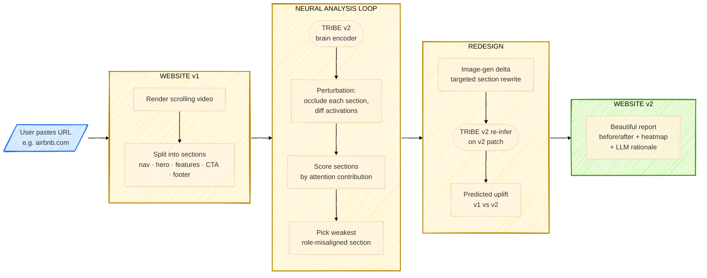
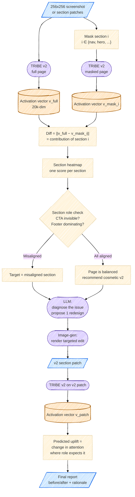
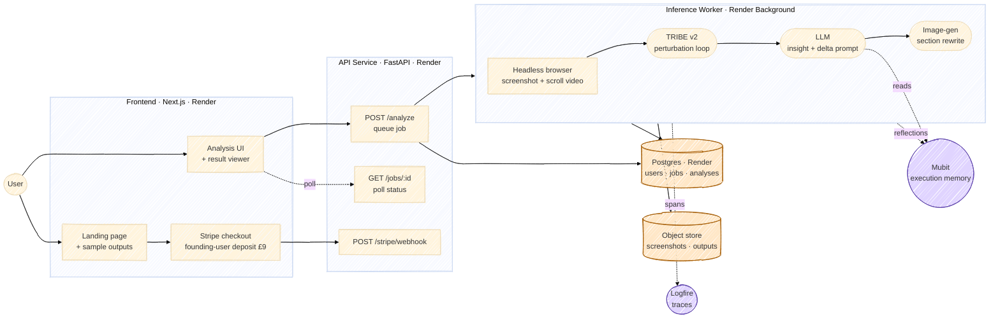
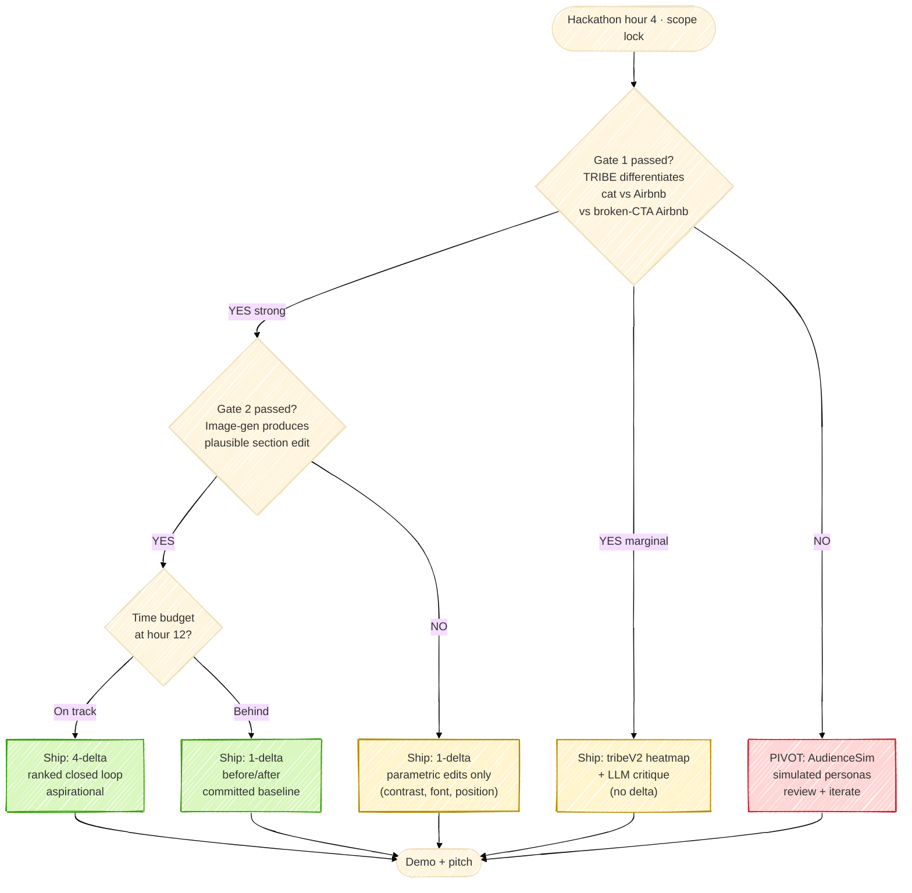
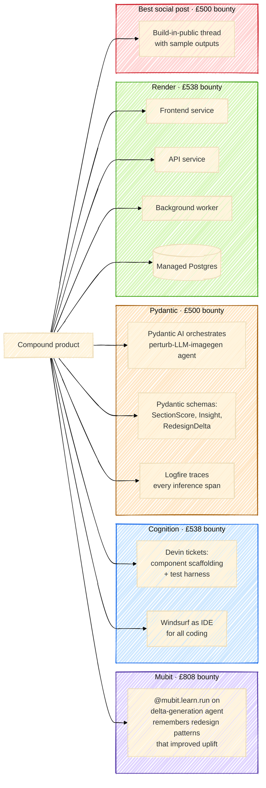
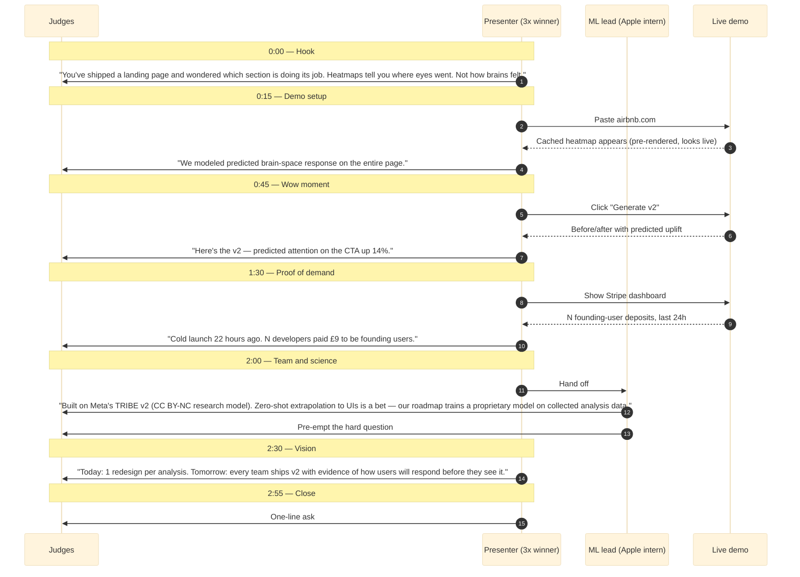
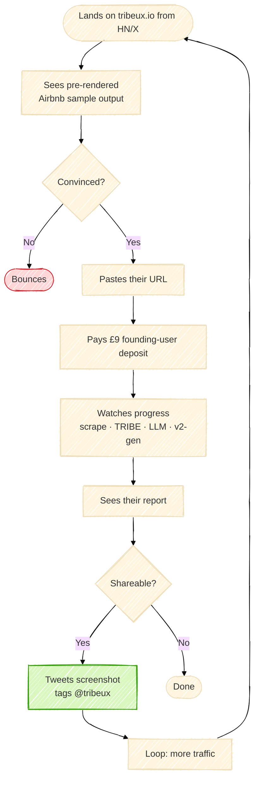
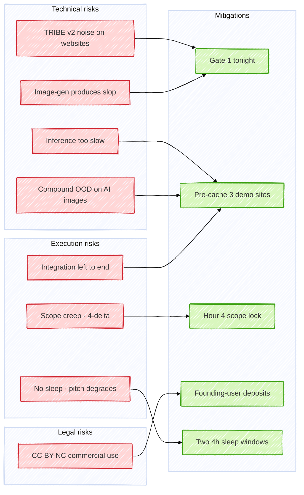
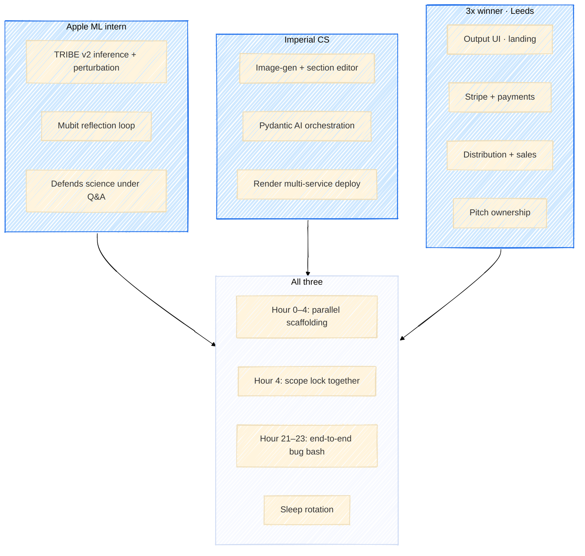

# Compound — Master Plan

**One paragraph.** Paste a URL. We render the site, run it through Meta's TRIBE v2 brain-encoder, run perturbation analysis to find the section with weakest predicted attention, generate a redesigned version of that section with image-gen, and show predicted uplift in a beautiful before/after report. Demo uses TRIBE v2 (CC BY-NC) as a research prototype; the commercial product roadmap trains a proprietary model on collected data. Founding-user deposits at £9.

---

## 1. The picture (end-to-end)

This is the whole product in one picture. Everything below is detail.

---

## 2. Closed-loop architecture (what happens inside "neural analysis")

**Key invariant:** we never claim TRIBE outputs are "brain activity." We say "predicted brain-space representation." Recommendations are LLM-authored over those representations. License attribution shown in footer of every report.

---

## 3. Service architecture

**Sponsor integration sites marked.** Logfire traces every span in the worker. Mubit stores reflections from each analysis ("this redesign pattern increased predicted uplift") and reads them on the next run.

---

## 4. 24-hour execution timeline

```mermaid
---
config:
  look: handDrawn
  theme: base
---
gantt
    title Hackathon Execution — Saturday 11:00 → Sunday 11:00
    dateFormat HH:mm
    axisFormat %H:%M

    section Foundation
    Repo + Render + Stripe scaffold     :done, h0, 11:00, 2h
    TRIBE v2 boot + first inference     :crit, h0a, 11:00, 3h
    Image-gen pilot on Airbnb           :h0b, 11:00, 2h

    section Gates
    Gate 1 cat-vs-Airbnb cosine test    :crit, gate1, 14:00, 1h
    Gate 2 image-gen plausibility       :gate2, 13:00, 1h
    Scope-lock decision (1d vs 4d)      :milestone, lock, 15:00, 0

    section Build
    Perturbation loop                   :h1, 15:00, 4h
    Section role classifier             :h1b, 15:00, 2h
    LLM insight prompt + Pydantic AI    :h2, 16:00, 4h
    Image-gen delta integration         :h3, 17:00, 4h
    Mubit reflection loop               :h3b, 19:00, 2h

    section UI
    Output report design                :h4, 13:00, 6h
    Landing + sample outputs cached     :h4b, 14:00, 4h
    Payment flow (deposits)             :h5, 18:00, 3h

    section Integration
    End-to-end first run                :crit, ee, 21:00, 2h
    Logfire wiring                      :h6, 22:00, 1h
    Render multi-service deploy         :h6b, 23:00, 2h

    section Sleep
    Sleep window 1 (2 of 3)             :sleep1, 01:00, 4h
    Sleep window 2 (rotating)           :sleep2, 05:00, 3h

    section Distribution
    HN Show post (US morning)           :crit, hn, 02:00, 1h
    Twitter thread + screenshots        :tw, 03:00, 1h
    Indie Hackers post                  :ih, 04:00, 1h
    Personal network outreach           :pn, 04:00, 4h

    section Final
    Pitch script + 3 rehearsals         :pitch, 06:00, 2h
    Bug bash + demo path test           :bb, 08:00, 1h
    Submission (1h before deadline)     :crit, sub, 12:00, 1h
```

**Hour 0 = doors open, 11:00 Saturday.** Hour 24 = submission deadline 13:00 Sunday (per official spec). Adjust if start-time shifts.

---

## 5. Decision tree — which version we ship

**Default = OneDelta.** Earn the right to FourDelta by passing Gate 2 + arriving at hour 12 on time. Never let perfect kill committed.

---

## 6. Sponsor integration map

**Effort budget:** Mubit + Cognition prioritised. Pydantic + Render natural fall-out of the build. Social post is 30 min near hour 24 — basically free.

---

## 7. Pitch sequence (3 minutes)

**Pitch principle:** Pattern 3 from the playbook (one wow moment) is the v2 reveal at 1:00. Pattern 8 (vision slide) is the closing. The license attribution at 2:00 turns the biggest credibility risk into a roadmap strength.

---

## 8. User journey · paying customer

**Conversion lever 1:** sample output BEFORE paywall. **Conversion lever 2:** result is screenshot-worthy by design (the v2 reveal is the share moment).

---

## 9. Risk register (live)

---

## 10. Team roles

---

## 11. Pre-hack checklist (today, before 11:00)

- [ ] **Gate 1** — `cosine_similarity(tribe(airbnb), tribe(cat))` < 0.9 AND `cosine_similarity(tribe(airbnb), tribe(airbnb_invisible_cta))` < 1.0
- [ ] **Gate 2** — generate one targeted edit of Airbnb hero with image-gen; 3 humans say "designer mockup, not slop"
- [ ] **Stripe live** — sole-trader entity, founding-user-deposit checkout, T&Cs in place
- [ ] **Domain bought** — tribeux.io or equivalent
- [ ] **Render account + Pydantic Logfire account + Mubit signup**
- [ ] **3 demo sites pre-rendered** (Airbnb, Stripe, Linear) — saved as PNGs
- [ ] **Pitch script v0** — written, but not rehearsed yet
- [ ] **Sleep schedule** — assigned to teammates

---

## 12. Locked decisions (do not revisit during the hack)

| Decision | Choice | Why |
|---|---|---|
| Pricing | £9 founding-user **deposit** (refundable) | License + value density |
| Default ship | 1-delta before/after | Demo reliability over feature ambition |
| Aspiration | 4-delta ranked, behind hour-12 gate | Earn it, don't promise it |
| Sponsors prioritised | Mubit + Cognition | Concentrated effort |
| Sponsors natural | Pydantic + Render | Falls out of the build |
| Pitch frame | "Research prototype with commercial roadmap" | Defuses license + science questions |
| Demo path | Pre-cached Airbnb output, live only for payment | Pattern 1 (demo-first) |
| Scope lock | Hour 4 | No additions after hour 6 |
| Submission | Hour 23 (1h before deadline) | Pattern 10 (don't submit late) |

---

## Appendix · key links

- TRIBE v2 — `github.com/facebookresearch/tribev2` (CC BY-NC)
- Mubit — `mubit.ai`
- Pydantic AI + Logfire — `pydantic.dev`
- Render — `render.com`
- Cognition (Devin + Windsurf) — `cognition.ai`

## Appendix · core rule

**Do NOT optimize for activation magnitude. Optimize for role-aligned response.**
The right signal in the right region for that section's job. A nav bar with low activation is correct. A CTA with low activation is broken. Recommendations are LLM-authored interpretations of modeled brain-space representations — not measurements.
